# Quizzard

Quizzard is a PHP and MySQL quiz platform for creating tests, assigning them to classes, sharing student credentials, running exams, and reviewing performance from an admin dashboard.

## Overview

The project has two main areas:

- A student-facing flow for login, dashboard access, quiz participation, answer submission, and completion tracking.
- An admin panel for managing classes, importing question sheets, creating tests, assigning students, and reviewing reports.

## Tech Stack

- PHP
- MySQL / MariaDB
- Bootstrap
- jQuery
- FPDF
- SpreadsheetReader

## Project Structure

```text
.
|-- admin/
|-- css/
|-- database/
|-- files/
|-- fonts/
|-- images/
|-- readme_images/
|-- vendor/
|-- brainrot_quiz.xlsx
|-- index.php
|-- README.md
`-- sampleQuizTemplate.xlsx
```

## Local Setup

1. Place the project inside your PHP server directory.
2. Create a MySQL database.
3. Import `database/script.sql` to create the schema.
4. Optionally import `database/sampleData.sql` for demo data.
5. Update `database/config.php` with your database credentials.
6. Open `index.php` for the student portal or `admin/index.php` for the admin panel.

## Database Config

Use `database/config_sample.php` as the reference format:

```php
define("DB_HOST","localhost");
define("DB_UNAME","YOUR_DATABASE_USER_NAME");
define("DB_PASS","YOUR_DATABASE_PASSWORD");
define("DB_DNAME","YOUR_DATABASE_NAME");
```

## Student Experience

Student users can:

- Log in with their roll number and password.
- Review assigned tests from the dashboard.
- Attempt quizzes question by question.
- Submit the test and review the completion state.

### Student Screens

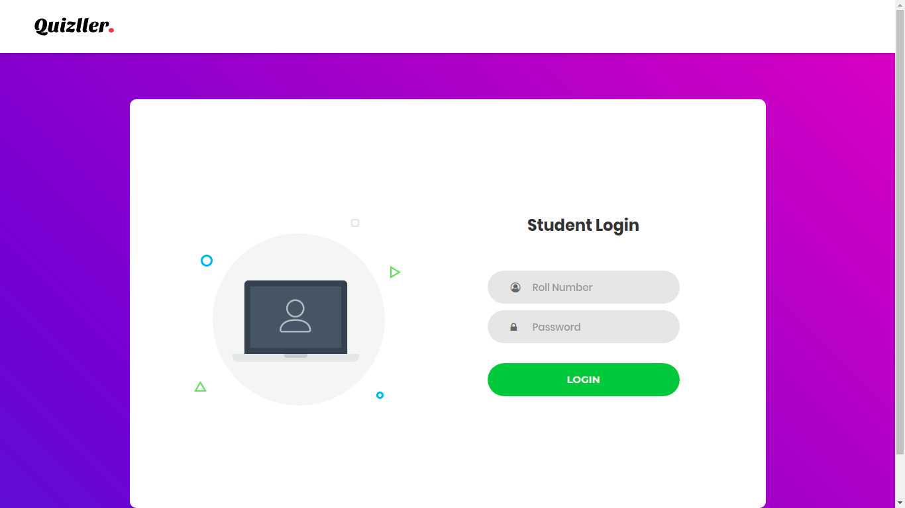

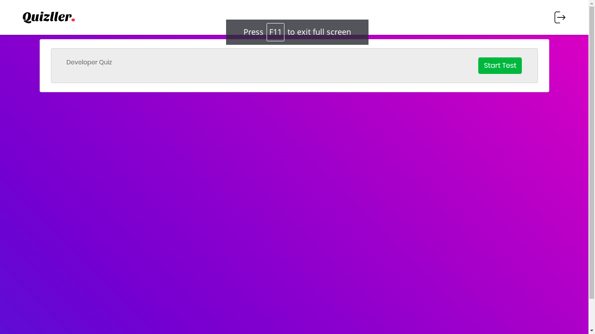

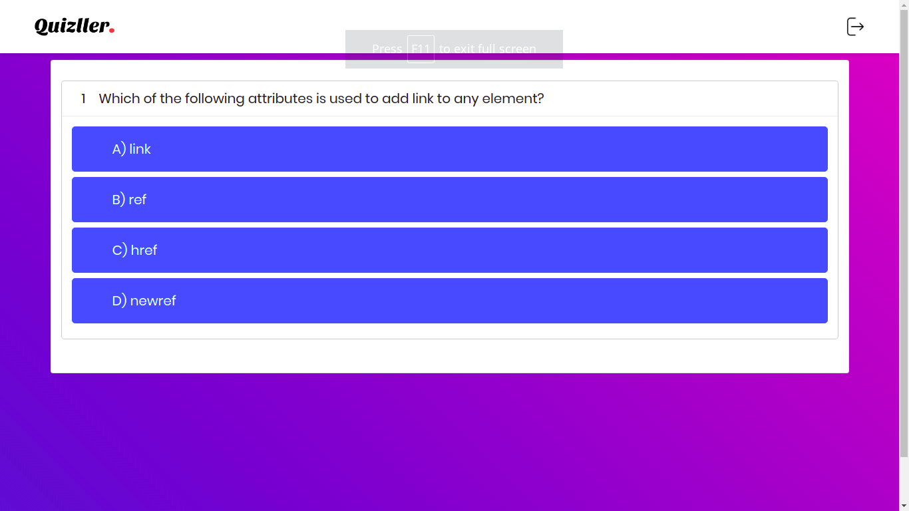

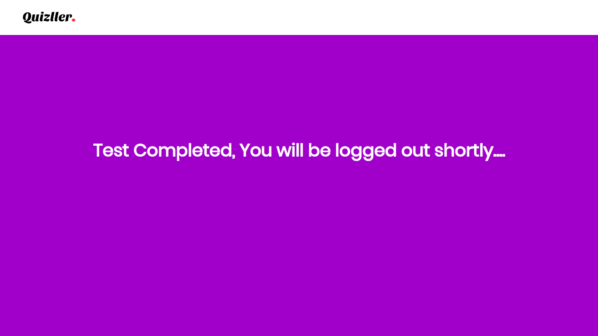

## Admin Experience

Admin users can:

- Sign in to the dashboard.
- Add classes and class data.
- Import quiz questions from spreadsheet files.
- Create tests and generate student credentials.
- Inspect test details and reporting pages.

### Admin Screens

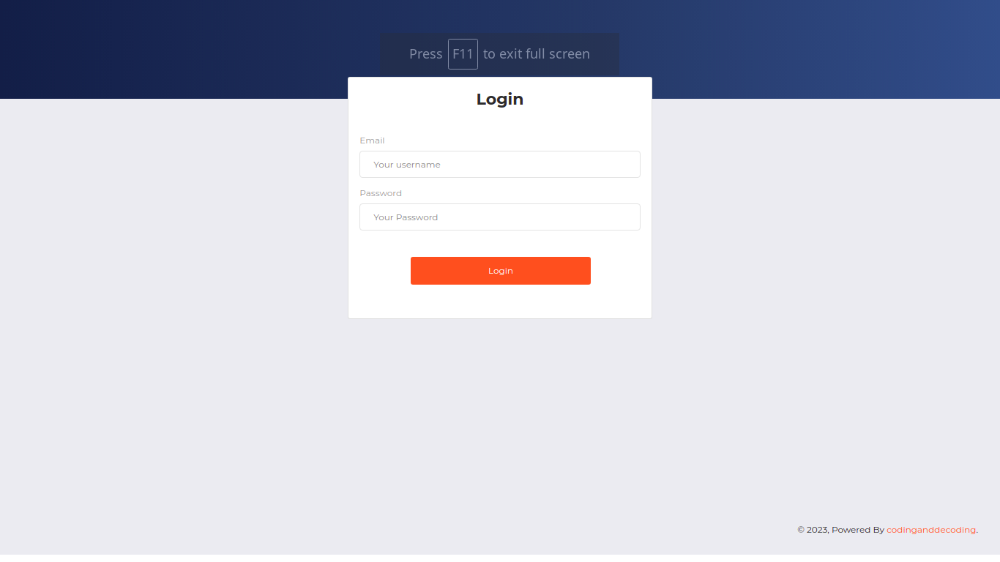

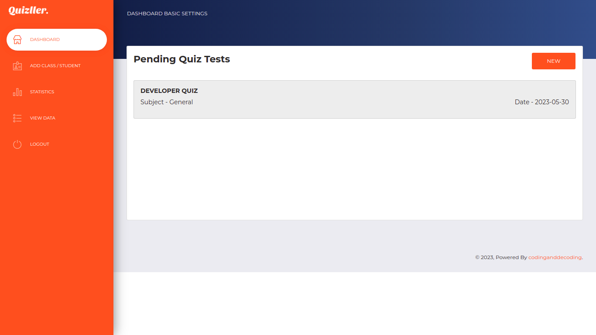

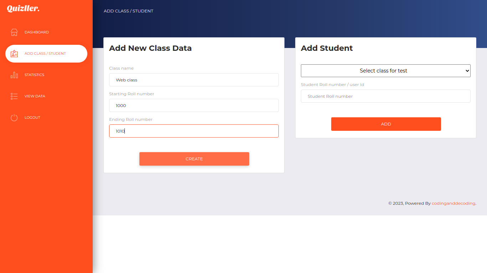

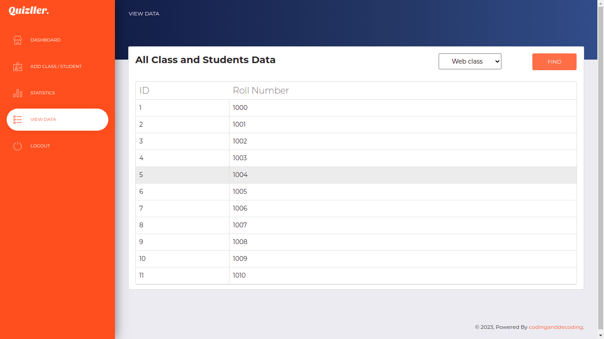

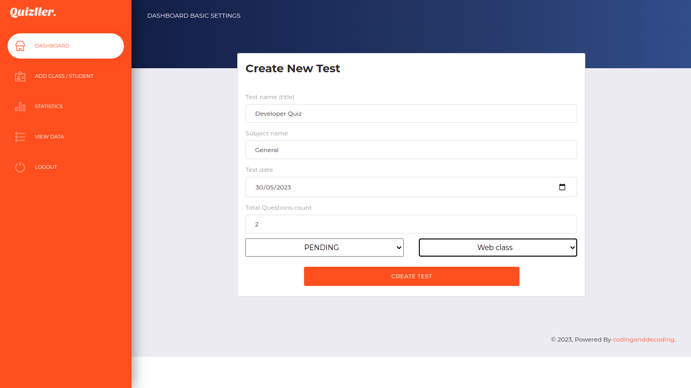

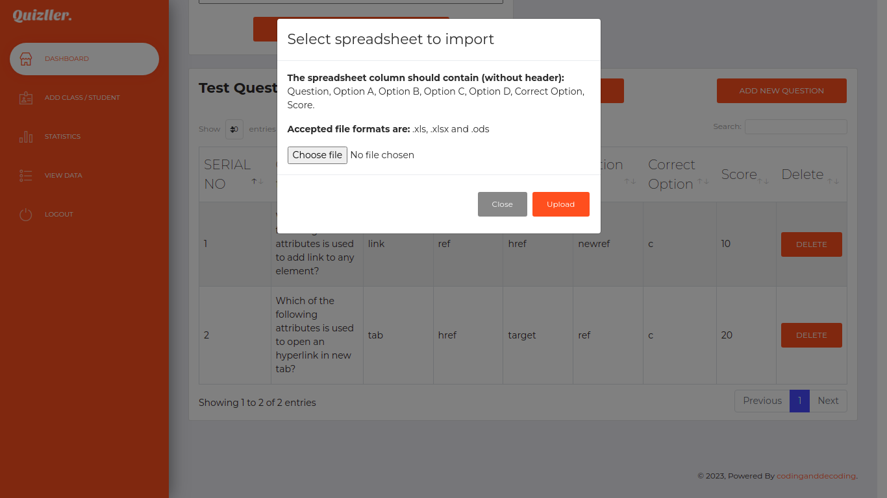

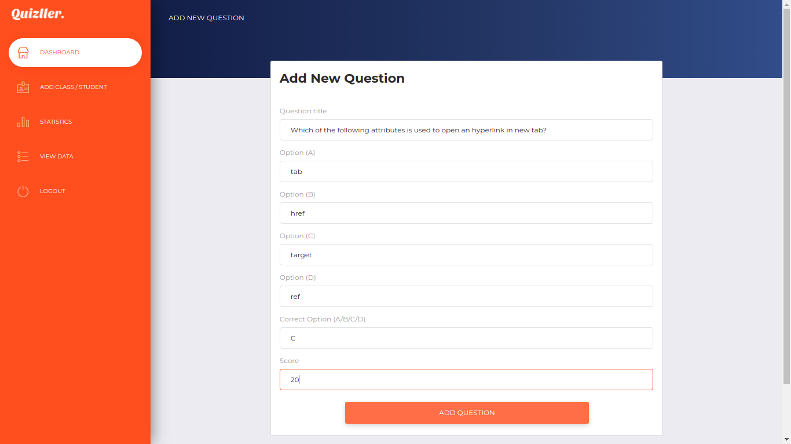

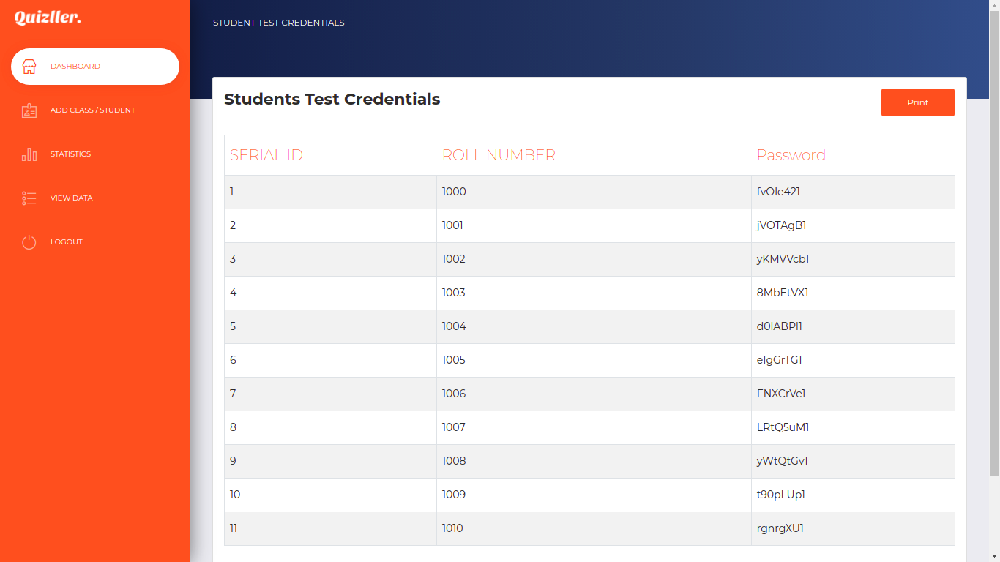

## Reporting Screens

The admin reporting area includes detail pages for generated tests, question banks, and aggregated student performance.

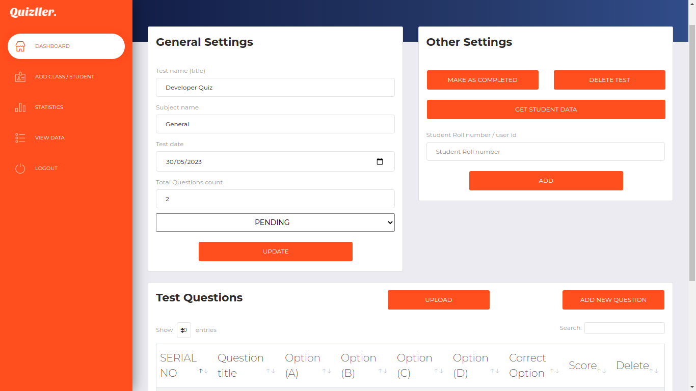

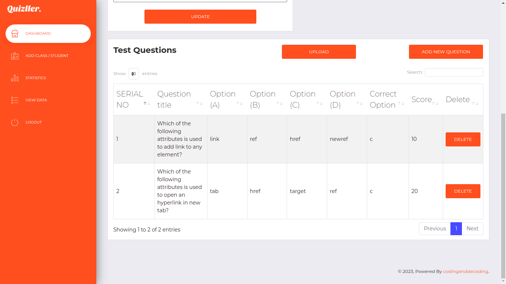

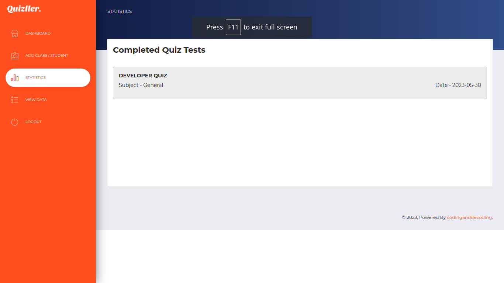

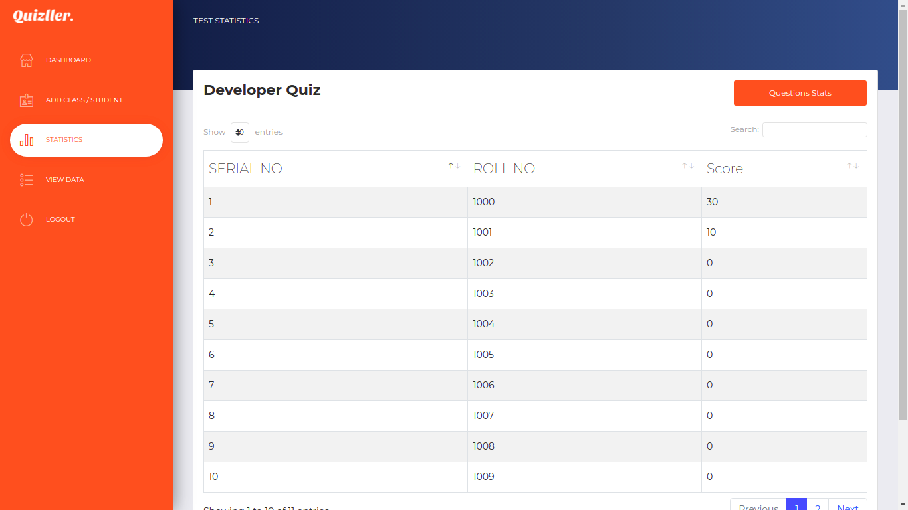

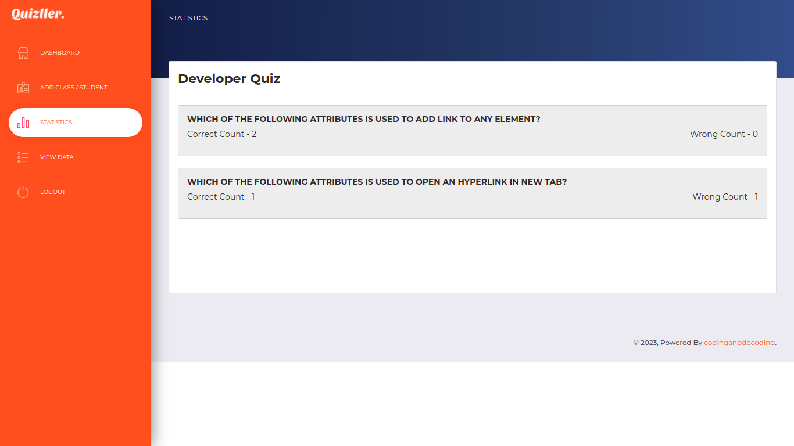

## Notes

- The original source project does not include a `package.json` or `.env` file because it is built as a PHP application instead of a Node-based stack.
- Spreadsheet samples are included at the project root and in `admin/files/uploads/` to match the source layout.
- `database/config.php` is the live connection file, and `database/config_sample.php` is the template for new environments.
